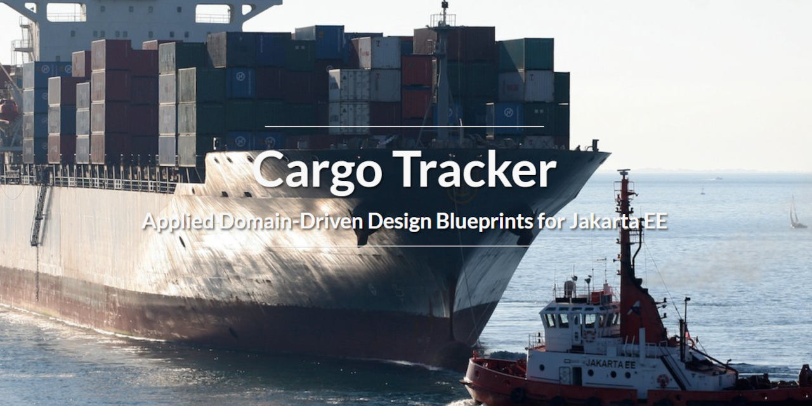

# Oracle Weblogic Server Cargo Tracker Application Deployed to Azure Kubernetes Service (AKS)
## Description 
In this sample app template of the Domain-Driven Design Jakarta EE application. The Application is built with Maven and deployed to Oracle WebLogic Server running in an Azure Kubernetes Service (AKS) exposed by Azure Application Gateway.

## Deploy Oracle WebLogic Server Application to Azure Kubernetes Service:

--
Tech stack:

- Azure Infra (VNet)
- Azure Kubernetes Service
- Azure Application Gateway
- Azure PostgreSQL DB
- Github Actions
- Bicep
- Docker
- Maven
- Java

---

## Introduction

This is a quickstart template. It deploys the following:

* Deploying Cargo Tracker App:
  * Create Progres SQL Database
  * Create the Cargo Tracker - build with Maven
  * Provisioning Azure Infra Services with ARM templates - build with BICEP
    * Create an Azure Container Registry
    * Build your app, Oracle WebLogic Server and domain configuration models into an image
    * Push your app image to the container registry
    * Create an Azure Kubernetes Service  
    * Deploy your app to AKS
    * Create an Azure Application Gateway
    * Expose your app with the application gateway
  * Verify your app

* Cargo Tracker on Automated CI/CD with GitHub Action  
  * CI/CD on GitHub Action
  * CI/CD in action with the app

> Refer to the [App Templates](https://github.com/microsoft/App-Templates) repo Readme for more samples that are compatible with [AzureAccelerators](https://github.com/Azure/azure-dev/).

## Prerequisites
- Local shell with Azure CLI installed or [Azure Cloud Shell](https://ms.portal.azure.com/#cloudshell/)
- Azure Subscription, on which you are able to create resources and assign permissions
  - View your subscription using ```az account show``` 
  - If you don't have an account, you can [create one for free](https://azure.microsoft.com/free). 
- You must have an Oracle account. To create an Oracle account and accept the license agreement for WebLogic Server images, follow the steps in [Oracle Container Registry](https://aka.ms/wls-aks-ocr). Make note of your Oracle Account password and email.

## Getting Started
### Fork the repository

1. Fork the repository by clicking the 'Fork' button on the top right of the page.
This creates a local copy of the repository for you to work in. 

2. Configure GITHUB Actions:  Follow the insturctions in the [GITHUB_ACTIONS_CONFIG.md file](.github/GITHUB_ACTIONS_CONFIG.md) (Located in the .github folder.)

3. Setup DB and Storage Account
  * Under your repository name, click Actions .
  * In the left sidebar, click the workflow "Setup DB and Storage Account".
  * Above the list of workflow runs, select Run workflow .
  * Use the Branch dropdown to select the workflow's main branch, Click Run workflow.
  * After the workflow completes, you'll find summary that lists the resource names.
    + Storage Account
    + Storage Container
    + Database

4. Setup WLS on AKS
  * Under your repository name, click Actions .
  * In the left sidebar, click the workflow "Setup WLS on AKS".
  * Above the list of workflow runs, select Run workflow.
  * Configure the workflow.
    + Use the Branch dropdown to select the workflow's main branch.
    + For **Included in names to disambiguate. Get from another pipeline execution**, enter disambiguation prefix, e.g. `test01`.
    + For **Azure region for resources**, keep default value `eastus`.
    + For **Specify storage account of uploading .war file**,  enter the storage account name that shows in "Setup DB and Storage Account" summary.
    + For **Specify name of storage container within account**, enter the storage container name that shows in "Setup DB and Storage Account" summary.
    + For **Name of the database. Get from another pipeline run**, enter the database name shows in "Setup DB and Storage Account" summary.

# Cargo Tracker Website



4. If you wish to view the Pet Store Deployment, you have the following options:

- Log into the Azure Portal
- Nagivate the the "petstore_spoke_eastus" Resource Group
- Locate the Wep App named: jbeappetstorewebapp (this is just a sample of what the Web App might be named)
- Click it...
- On the upper Right Hand Side, you will see a URL:  https://xxxxxxxxxxxxxxxxxxx.azurewebsites.net (this is just a sample URL)
- Click it...
- A new page will open....it may take like 20 to 30 seconds to load (the WAR file is unpacking)
- Once open, you will see the Pet Store Applicaiton Landing Page....

